# Deploying Qualys Container Security Registry Sensor Across Multi-Cloud Environments

This guide provides a comprehensive overview of deploying the Qualys Container Security Registry Sensor across AWS (ECS and EKS), Azure AKS, and GCP GKE with enterprise-grade security controls aligned with CIS Benchmarks.

## Architecture Overview

```mermaid
flowchart TB
    subgraph "Qualys Platform"
        QP[Qualys Cloud Platform]
    end

    subgraph "AWS ECS"
        subgraph "VPC - 172.20.250.0/24"
            subgraph "Private Subnets ECS"
                ECS[ECS Cluster]
                EC2[EC2 Instances]
                SENSOR1[Qualys Container Security Registry Sensor]
            end
            subgraph "Public Subnets ECS"
                NAT1[NAT Gateway]
            end
        end
        SM[Secrets Manager]
        CW[CloudWatch Logs]
        KMS[KMS Keys]
    end

    subgraph "AWS EKS"
        subgraph "VPC - 172.20.0.0/16"
            subgraph "Private Subnets EKS"
                EKS[EKS Cluster]
                NODES[Node Groups]
                SENSOR1B[Qualys Registry Sensor DaemonSet]
            end
            subgraph "Public Subnets EKS"
                NAT1B[NAT Gateway]
            end
        end
        OIDC[OIDC Provider]
        CW2[CloudWatch Logs]
        KMS2[KMS Keys]
    end

    subgraph "Azure"
        subgraph "VNet - 10.1.0.0/16"
            subgraph "AKS Subnet"
                AKS[AKS Cluster]
                NODES1[Node Pool]
                SENSOR2[Qualys Registry Sensor DaemonSet]
            end
        end
        NAT2[NAT Gateway]
        KV[Key Vault]
        LA[Log Analytics]
        DEF[Defender for Containers]
    end

    subgraph "GCP"
        subgraph "VPC - 10.0.0.0/20"
            subgraph "GKE Subnet"
                GKE[GKE Cluster]
                NODES2[Node Pool]
                SENSOR3[Qualys Registry Sensor DaemonSet]
            end
        end
        NAT3[Cloud NAT]
        GSM[Secret Manager]
        CL[Cloud Logging]
        BIN[Binary Authorization]
    end

    SENSOR1 -->|HTTPS 443| NAT1 -->|Scan Results| QP
    SENSOR1B -->|HTTPS 443| NAT1B -->|Scan Results| QP
    SENSOR2 -->|HTTPS 443| NAT2 -->|Scan Results| QP
    SENSOR3 -->|HTTPS 443| NAT3 -->|Scan Results| QP

    EC2 --> SM
    EKS --> OIDC
    AKS --> KV
    GKE --> GSM
```

## Deployment Workflow

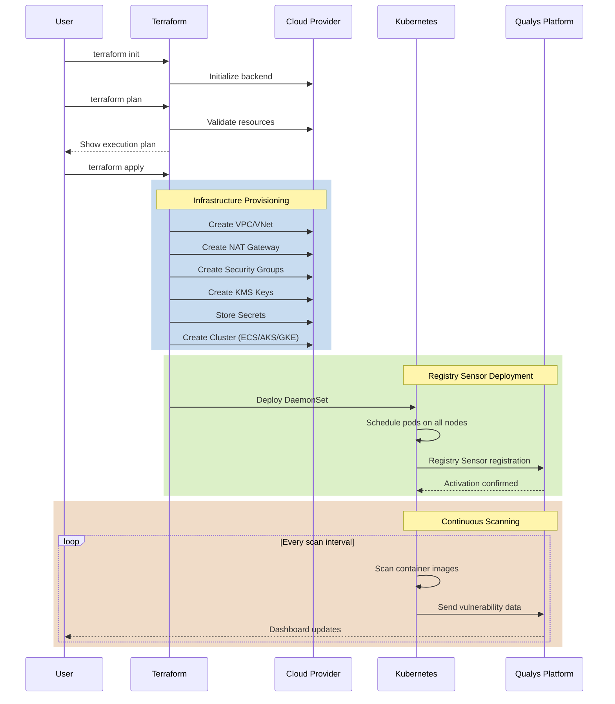

## Security Architecture

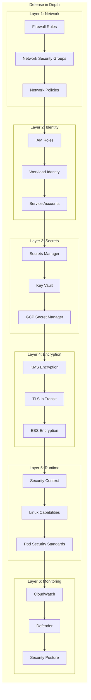

## AWS ECS Architecture

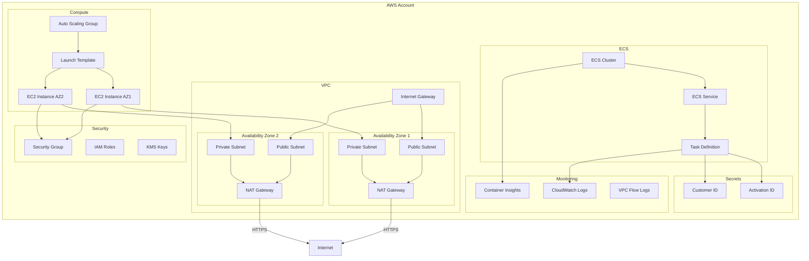

## AWS EKS Architecture

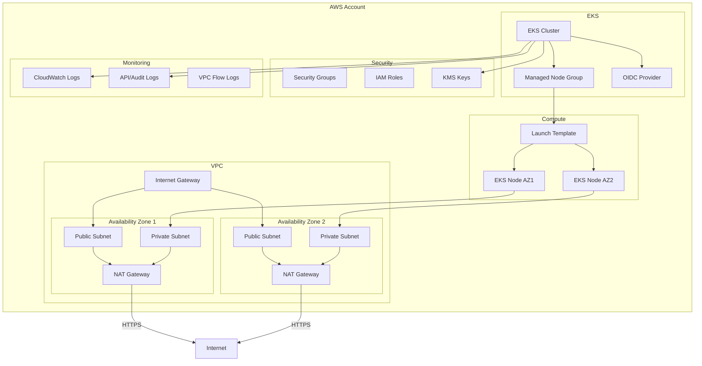

## Kubernetes DaemonSet Flow

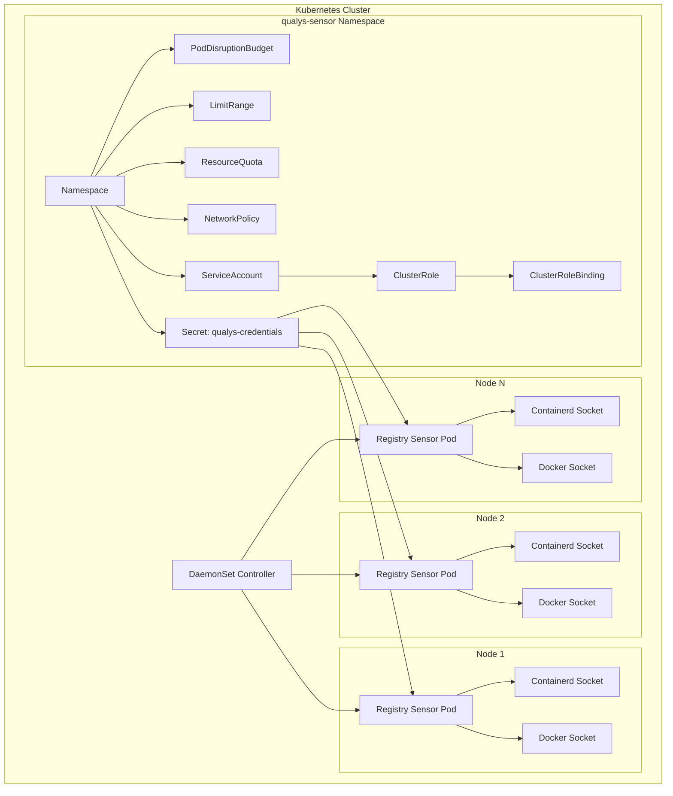

## Credential Flow

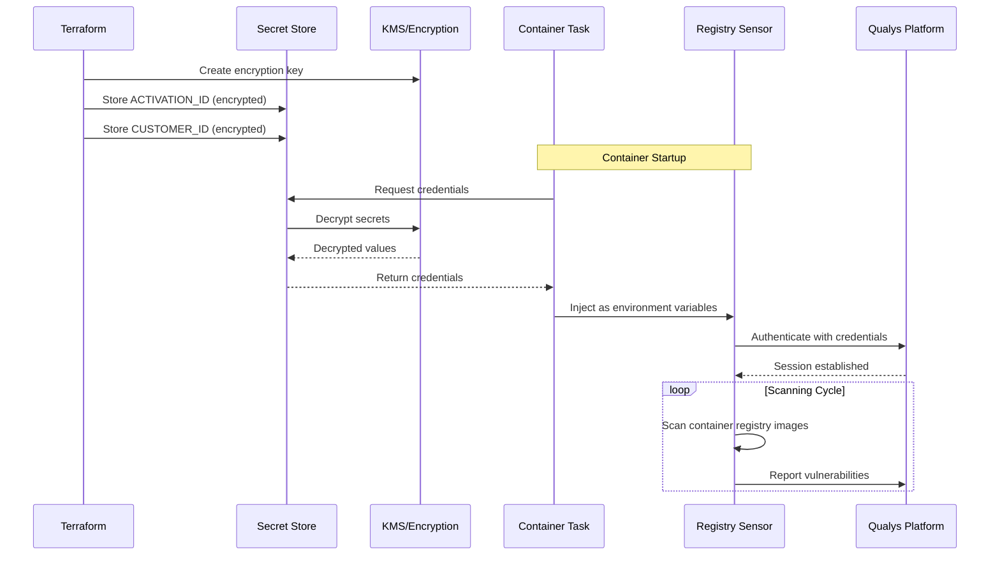

## Network Security Flow

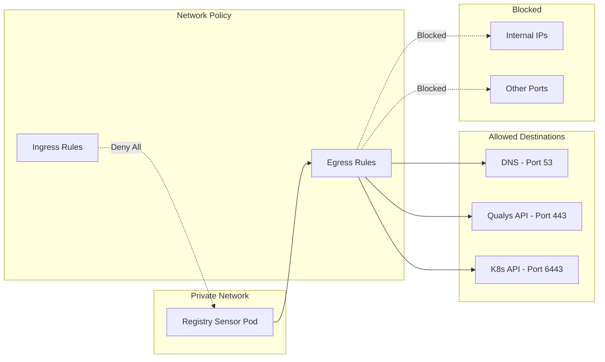

## Container Security Context

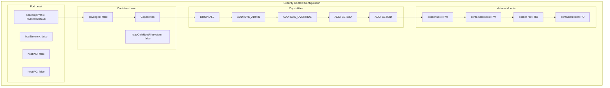

## Multi-Cloud Comparison

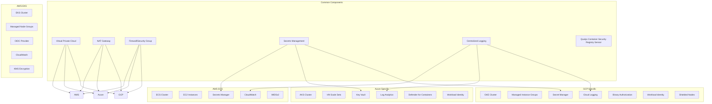

## Deployment Commands

### AWS ECS
```bash
cd aws
terraform init
terraform plan
terraform apply
```

### AWS EKS
```bash
cd aws-eks
terraform init
terraform plan
terraform apply

aws eks update-kubeconfig --name qualys-registry-cluster --region us-east-1
kubectl apply -f ../kubernetes/qualys-daemonset.yaml
```

### Azure
```bash
cd azure
terraform init
terraform plan
terraform apply

az aks get-credentials --resource-group qualys-registry-sensor-rg --name qualys-registry-cluster
kubectl apply -f ../kubernetes/qualys-daemonset.yaml
```

### GCP
```bash
cd gcp
terraform init
terraform plan
terraform apply

gcloud container clusters get-credentials qualys-registry-cluster --region us-central1
kubectl apply -f ../kubernetes/qualys-daemonset.yaml
```

## Security Controls Summary

| Control | AWS ECS | AWS EKS | Azure AKS | GCP GKE |
|---------|---------|---------|-----------|---------|
| Secrets Management | Secrets Manager + KMS | Kubernetes Secrets + KMS | Key Vault | Secret Manager |
| Network Isolation | VPC + Private Subnets | VPC + Private Subnets | VNet + NAT Gateway | VPC + Cloud NAT |
| API Restriction | Security Groups | Security Groups + OIDC | NSG + API IP Ranges | Firewall + Master Auth Networks |
| Encryption at Rest | EBS + KMS | EBS + KMS | Ephemeral Disks | pd-ssd |
| Encryption in Transit | TLS 1.2+ | TLS 1.2+ | TLS 1.2+ | TLS 1.2+ |
| Identity | IAM Roles + IMDSv2 | IAM Roles + OIDC | Managed Identity + Workload Identity | Workload Identity |
| Logging | CloudWatch + Flow Logs | CloudWatch + API Logs | Log Analytics + Defender | Cloud Logging + Prometheus |
| Image Security | ECR Scanning | ECR Scanning | ACR + Defender | Binary Authorization |
| Runtime Security | Container Insights | Container Insights | Azure Policy | Security Posture |
| Node Security | EBS Encryption | EBS Encryption + IMDSv2 | Ephemeral OS Disks | Shielded Nodes |

## Monitoring and Observability

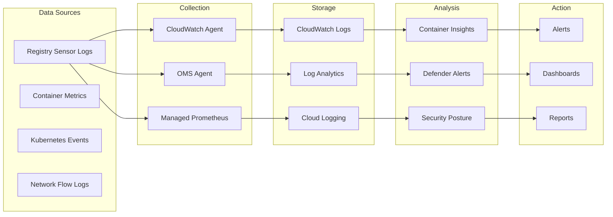

## Conclusion

This multi-cloud deployment provides a consistent, secure approach to deploying the Qualys Container Security Registry Sensor across AWS (ECS and EKS), Azure AKS, and GCP GKE. Key security features include:

- **Secrets stored in cloud-native secret managers** with KMS encryption
- **Private networking** with NAT gateways for outbound-only access
- **Network policies** restricting pod communication
- **Workload identity** for secure cloud API access
- **Comprehensive logging** and monitoring
- **Binary authorization** (GCP) for image verification
- **Defender for Containers** (Azure) for threat detection
- **Container Insights** (AWS) for performance monitoring
- **OIDC provider** (EKS) for IAM Roles for Service Accounts

All configurations follow CIS Benchmarks and cloud provider security best practices.
